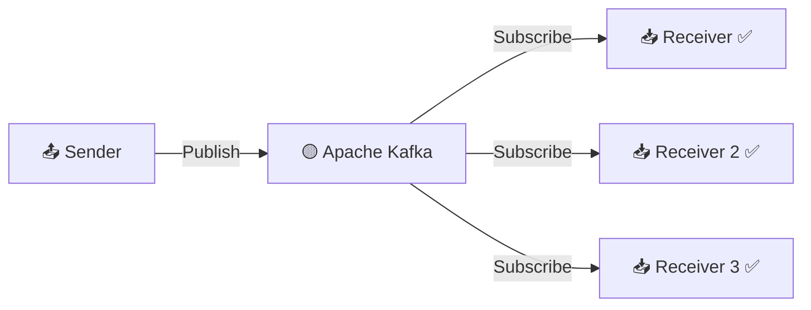
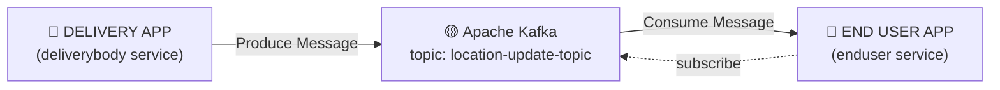
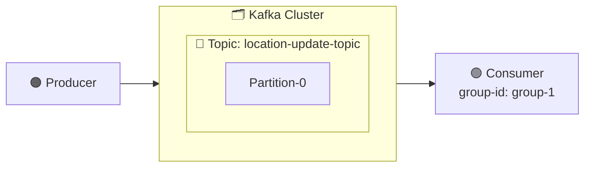

# 🚀 kafka-learning-spring-boot

Learning **Apache Kafka** fundamentals with **Spring Boot** — a producer (`deliverybody` service) and consumer (`enduser` service) exchanging live location update events, inspired by how apps like Zomato/Swiggy broadcast a delivery partner's location in real time.

---

## 📖 What is Apache Kafka?

> Apache Kafka is a communication system that helps different parts of a system exchange data by **publishing** and **subscribing** to topics.



A sender publishes a message once — Kafka lets **any number of subscribers** receive it independently.

---

## 🍔 This Project's Use Case: Live Location Updates



| Service | Role | Package | Port |
|---|---|---|---|
| `deliverybody` | 📤 Producer — publishes location updates | `com.deliveryboy` | `8080` *(default)* |
| `enduser` | 📥 Consumer — listens for location updates | `com.enduser` | `8081` |

---

## 🏗️ Kafka Architecture



- **Topic** — `location-update-topic`, the channel location events are published to.
- **Producer** — `deliverybody`'s `KafkaService`, sending via `KafkaTemplate<String, String>`.
- **Consumer** — `enduser`'s `KafkaConfig`, listening via `@KafkaListener`.
- **Broker** — the local Kafka instance running on `localhost:9092`.

---

## 🧰 Tech Stack

- ☕ Java 17
- 🌱 Spring Boot 3.1.3
- 📨 Spring for Apache Kafka (`spring-kafka`)
- 🌐 Spring Web (REST endpoint to trigger the producer)
- 📦 Maven

---

## 📂 Project Structure

```
kafka-learning-spring-boot/
├── deliverybody/deliverybody/          # 📤 Producer service
│   └── src/main/java/com/deliveryboy/
│       ├── DeliverybodyApplication.java
│       ├── config/
│       │   ├── AppConstants.java       # topic name constant
│       │   └── KafkaConfig.java        # creates the Kafka topic
│       ├── controller/
│       │   └── LocationController.java # POST /location/update
│       └── service/
│           └── KafkaService.java       # publishes messages
│
└── enduser/enduser/                    # 📥 Consumer service
    └── src/main/java/com/enduser/
        ├── EnduserApplication.java
        ├── AppConstants.java           # topic + group-id constants
        └── KafkaConfig.java            # @KafkaListener consumer
```

---

## ▶️ Getting Started

### 1. Start Kafka locally
Make sure a Kafka broker is running on `localhost:9092` (KRaft or Zookeeper mode both work).

### 2. Run the producer (`deliverybody`)
```bash
cd deliverybody/deliverybody
./mvnw spring-boot:run
```

### 3. Run the consumer (`enduser`)
```bash
cd enduser/enduser
./mvnw spring-boot:run
```

### 4. Trigger a location update
```bash
curl -X POST http://localhost:8080/location/update
```
Watch the `enduser` console — it prints every message it consumes from `location-update-topic` in real time.

> ⚠️ Heads-up: `LocationController` currently sends **200,000** random location messages in a tight loop per request — that's intentional for stress-testing throughput while learning, not a typical real-world pattern.

---

## ⚙️ Configuration Reference

**`deliverybody` (producer) — `application.properties`**
```properties
spring.kafka.producer.bootstrap-servers=localhost:9092
spring.kafka.producer.key-serializer=org.apache.kafka.common.serialization.StringSerializer
spring.kafka.producer.value-serializer=org.apache.kafka.common.serialization.StringSerializer
```

**`enduser` (consumer) — `application.properties`**
```properties
server.port=8081
spring.kafka.consumer.bootstrap-servers=localhost:9092
spring.kafka.consumer.group-id=group-1
spring.kafka.consumer.auto-offset-reset=earliest
spring.kafka.consumer.key-deserializer=org.apache.kafka.common.serialization.StringDeserializer
spring.kafka.consumer.value-deserializer=org.apache.kafka.common.serialization.StringDeserializer
```

---

## 🧪 Also Explored: Kafka via the Console

Before wiring up Spring Boot, the same producer → consumer flow was tested with Kafka's CLI tools:

1. 🆕 Create a topic with `kafka-topics.sh`
2. 📤 Produce a message with `kafka-console-producer.sh`
3. 📥 Consume it with `kafka-console-consumer.sh`

---

## 🎯 What This Project Covers

- ✅ Kafka core concepts — topics, partitions, brokers, consumer groups
- ✅ Producing messages from a Spring Boot REST endpoint
- ✅ Consuming messages with `@KafkaListener`
- ✅ Running Kafka via the console (topics, producer, consumer CLIs)
- ✅ Running independent producer/consumer microservices side by side

---

## 👤 Author

**Shaik Nayeem Basha**
🔗 [GitHub](https://github.com/Nayeemshaik29)
